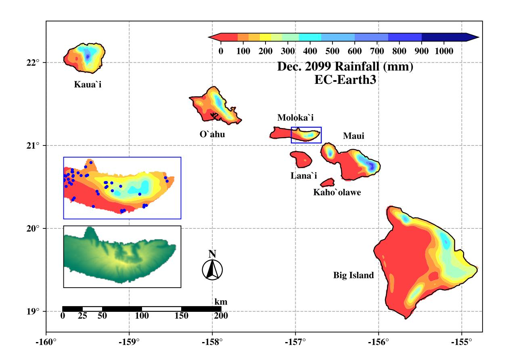
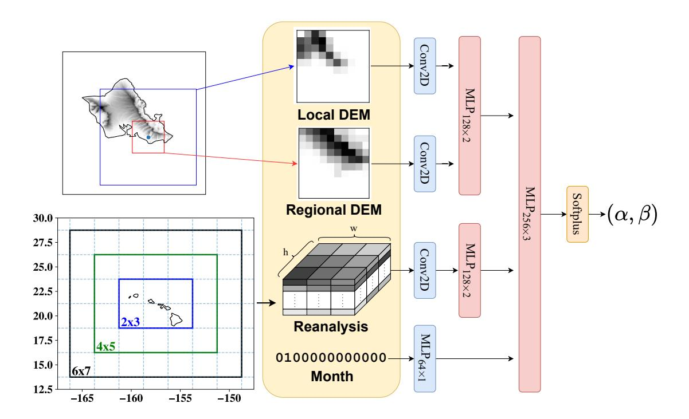
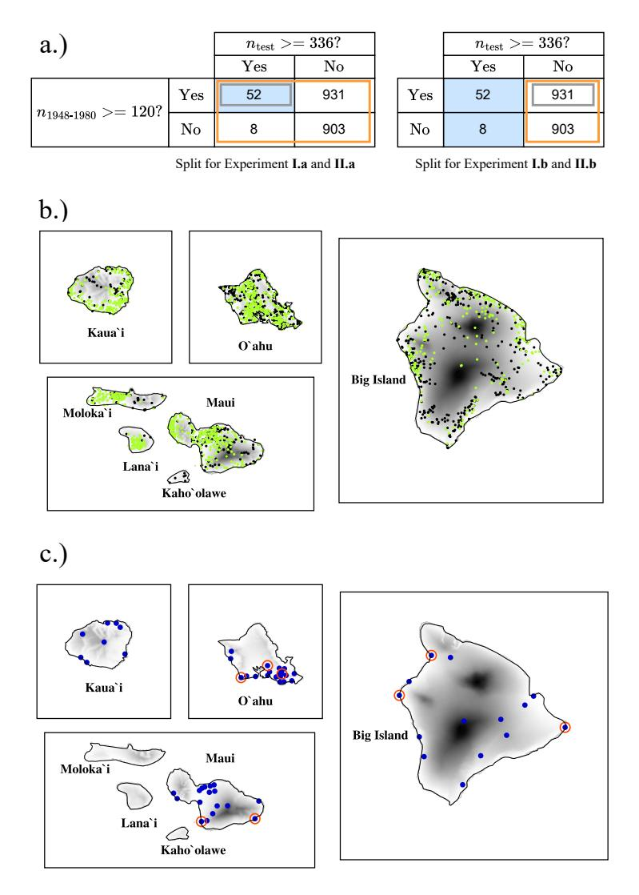
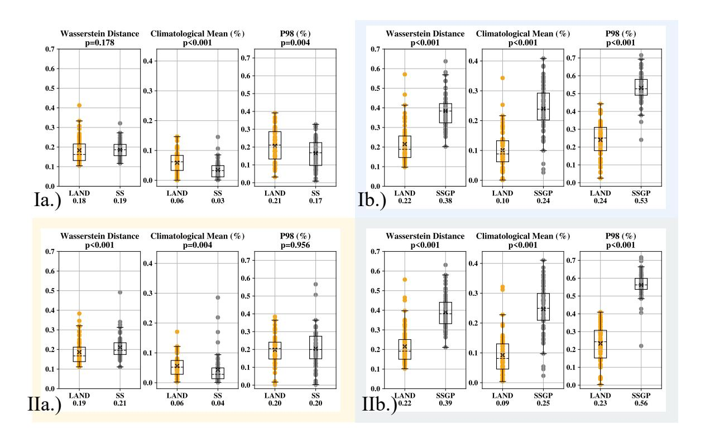
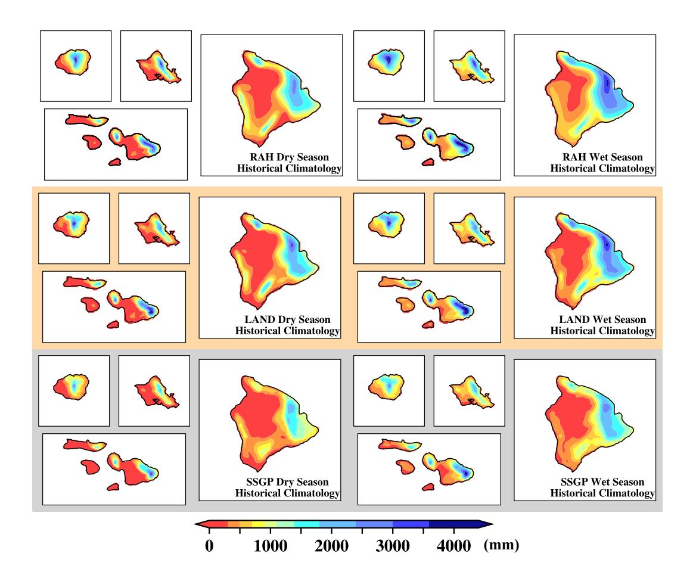
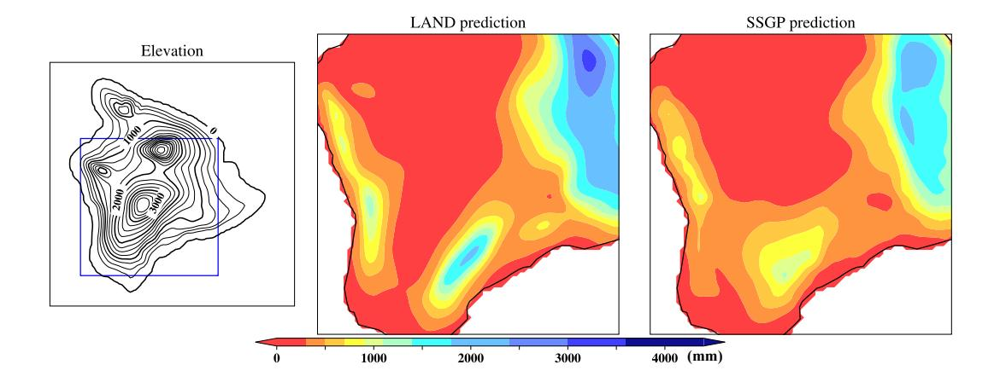
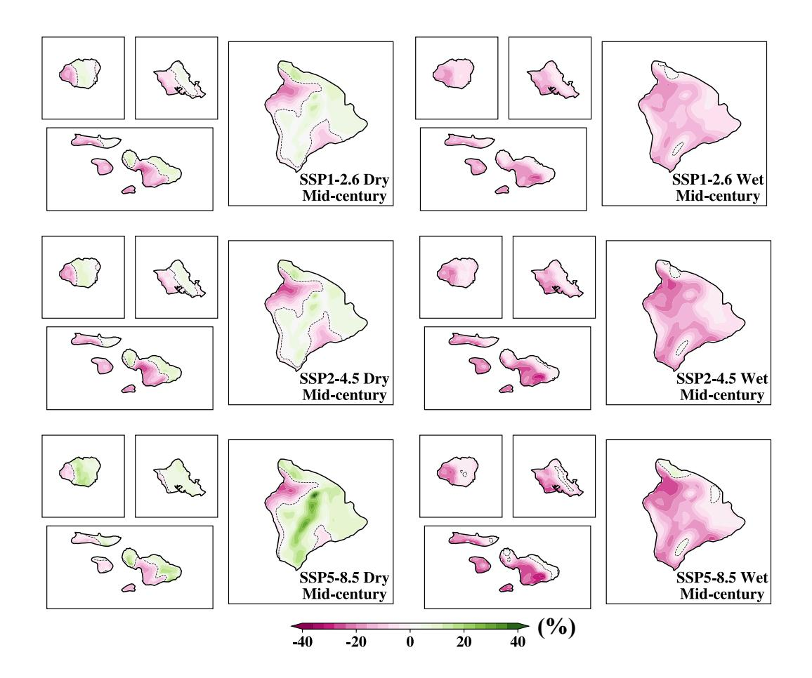
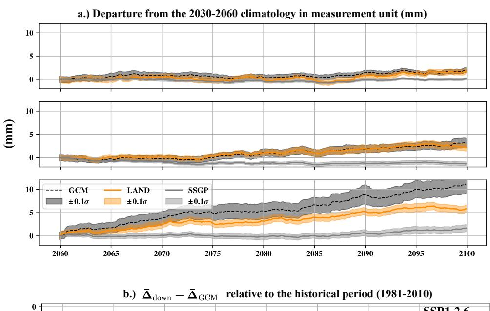
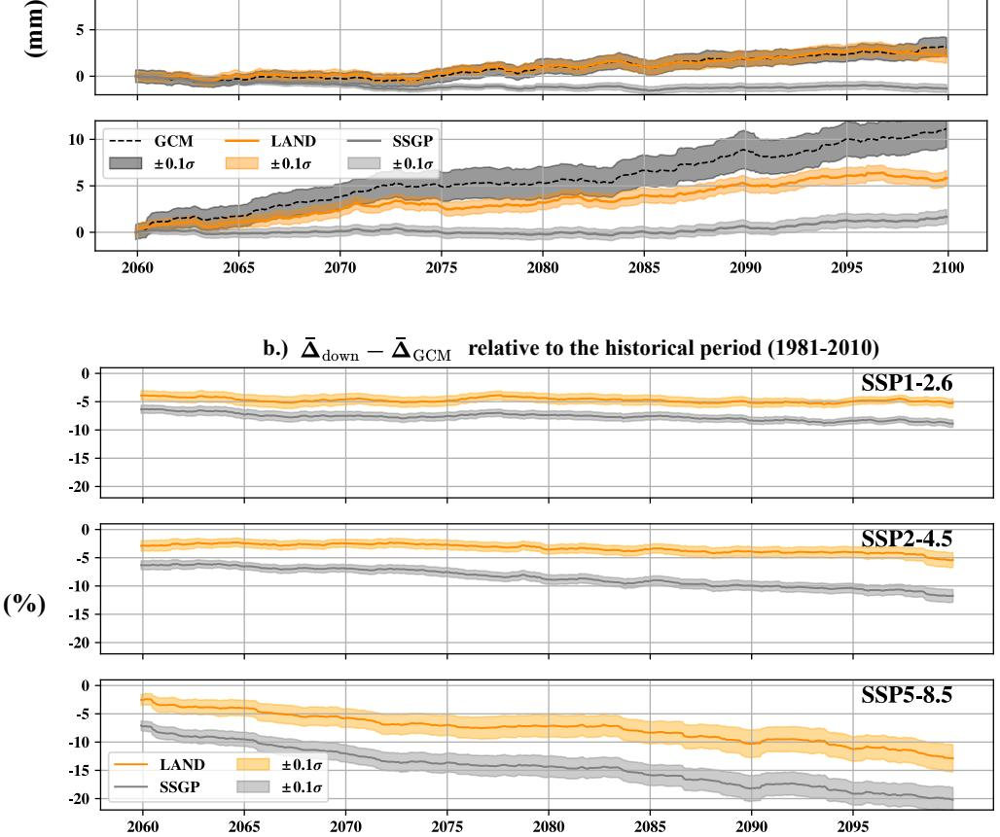

# 1 **Super Resolution Statistical Downscaling from Sparse Observations with**

## 2 **Deep Learning for Monthly Rainfall Projections in Hawai'i**

- Yusuke Hatanakaa , Amila Indikaa , Thomas Giambellucab,c and Peter Sadowskia
- a 4 *Information and Computer Sciences, University of Hawai'i at Manoa, Hawai'i, USA ¯*
- b 5 *Geography and Environment, University of Hawai'i at Manoa, Hawai'i, USA ¯*
- c *Water Resources Research Center, University of Hawai'i at Manoa, Hawai'i, USA ¯*

7 *Corresponding author*: Peter Sadowski, psadow@hawaii.edu

ABSTRACT: Hawai'i faces a severe scarcity of precipitation observations, particularly in gridded datasets. This limitation constrains the application of statistical downscaling methods, which are especially valuable in regions where large-scale atmospheric models fail to resolve hyper-local rainfall gradients arising from complex topography. We present a deep learning method, the Location-Agnostic Neural Downscaler (LAND), designed to leverage sparse observational data to downscale coarse global model outputs to sub-kilometer resolution. We evaluate LAND across multiple settings to assess its ability to generalize to (1) unseen locations, (2) different GCMs, and (3) future climate scenarios. Compared with a strong baseline that combines site-specific models and Gaussian processes, LAND demonstrates substantially greater robustness in generalizing to unseen locations, achieving a 20% reduction in RMSE. LAND also outperforms the baseline under future scenarios, showing enhanced sensitivity to climate change signals. 8 9 10 11 14 16 17 18

- SIGNIFICANCE STATEMENT: Statistical downscaling is essential in regions such as Hawai'i,
- where the coarse resolution of global climate models cannot capture hyper-local precipitation
- patterns driven by complex topography. Traditional site-specific statistical downscaling partially
- mitigates this limitation, but the resulting predictions are spatially sparse and constrained by limited
- training data. A deep learning approach addresses these challenges by training a joint model capable
- of generating predictions at arbitrary locations on a gridded domain. This approach generalizes
- robustly to unseen locations while remaining sensitive to climate change signals.

#### **1. Introduction**

- Climate change is typically studied using general circulation models (GCMs) that simulate large-
- scale physical processes that govern atmospheric circulation. However, the relatively coarse spatial
- discretization of GCMs does not allow accurate simulation of processes at smaller spatial scales,
- which requires the additional step of *downscaling*. Downscaling methods convert coarse-resolution
- [G](#page-30-0)CM projections to finer-resolution projections [\(Lauer et al. 2013;](#page-32-0) [Ashfaq et al. 2022;](#page-28-0) [Feyissa](#page-30-0)
- [et al. 2023;](#page-30-0) [Rahman and Pekkat 2024;](#page-33-0) [Brands 2022;](#page-29-0) [Virgilio et al. 2022\)](#page-34-0), and consists of two
- principal approaches statistical and dynamical but dynamical downscaling requires physics-
- based simulations that are computationally expensive for orographically complex regions [\(Schmith](#page-34-1)
- [2008\)](#page-34-1). Thus, statistical downscaling is an essential tool for modeling climate change in regions
- such as Hawai'i [\(Elison Timm et al. 2015;](#page-30-1) [Elison Timm and Diaz 2009;](#page-30-2) [Elison Timm et al. 2011;](#page-30-3)
- [Sanfilippo et al. 2023\)](#page-34-2).
- Statistical downscaling is data-driven and relies on historical observation data for training.
- Machine learning methods have proven to be effective in many downscaling scenarios [\(Rampal et al.](#page-33-1)
- [2024\)](#page-33-1), but the availability of quality training data is a major limitation. A particularly challenging
- scenario is when the only ground truth comes from sparse observations at weather stations rather
- than high-resolution gridded data products. This requires addressing both the downscaling and
- spatial interpolation problems. Spatial interpolation is difficult in geographically complex regions
- such as Hawai'i, where the mountainous orography produces steep rainfall gradients with mean
- annual values ranging from 200 mm to over 10,000 mm per year within the state [\(Sanderson 1993;](#page-34-3)
- [Giambelluca et al. 2013\)](#page-31-0), resulting in hyperlocal rainfall patterns and microclimates across the
- islands.

 This work addresses the issues of sparse observations and limited training data by reframing the machine learning problem. While traditional statistical downscaling approaches treat the downscaling and interpolation problems separately, we investigate a model that predicts climate variables at any location as a function of the local elevation map and atmospheric variables, enabling the model to be trained on sparse data. We hypothesize that the combination of atmospheric and orographic features of a location largely determines the local climate, such that a general, site- agnostic model trained on observations from sparse locations will outperform separate models trained to predict rainfall at each location independently. We call our approach Location-Agnostic Neural Downscaling (LAND).

 We demonstrate LAND by downscaling monthly precipitation for the Hawaiian islands to 250 m resolution (see Figure [1\)](#page-4-0), where the model inputs are an elevation map, a binary vector representing the month, and monthly average atmospheric variables from reanalysis including pressure, tem- perature, moisture, surface conditions, and vertical motion. In experiments, we show that LAND outperforms the baseline approach that separately performs traditional site-specific downscaling and spatial interpolation, and the improvement is shown to hold when downscaling GCM output. This increase in performance is particularly important in Hawai'i, as long-term water resource management for the Hawaiian Islands depends on accurate estimates of future rainfall under a changing climate. This approach of training on reanalysis data and then downscaling GCM data is known as *perfect prognosis observational downscaling* [\(Rampal et al. 2024\)](#page-33-1), and relies on the as- sumption that the statistical relationship between fine and coarse climate features will generalize to atmospheric conditions produced by the GCM. Our approach is also an example of*super-resolution* downscaling — in contrast to site-specific downscaling — because it transforms coarse inputs into high-resolution gridded outputs.

#### **2. Related Work**

*a. Downscaling with Deep Learning*

 Machine learning methods have been applied to many downscaling scenarios, and [Rampal et al.](#page-33-1) [\(2024\)](#page-33-1) provides a recent review. One of the limiting factors for developing these models is typically the amount of observational data for training. Indeed, machine learning has seen more success in downscaling weather [\(Mardani et al. 2025;](#page-32-1) [Hatanaka et al. 2023;](#page-31-1) [Vaughan et al. 2022,](#page-34-4) [2024;](#page-34-5)

Fig. 1. Predicted monthly rainfall (in mm) for Dec. 2099 at all grid locations, based on EC-Earth3. *Upper Inset*: Zoom of the blue rectangle over the island of Moloka'i. The blue dots represent the locations of the weather stations in the training data. Weather stations on east Moloka'i are sparsely distributed, but the model smoothly interpolates based on the orographic features. *Lower Inset*: The elevation map on the zoomed region. 

[Baño-Medina et al. 2020;](#page-29-1) [Rampal et al. 2022;](#page-33-2) [Cannon 2008\)](#page-29-2) because the higher temporal resolution of weather observations provides larger training datasets. However, applying the same approaches to downscale future GCM outputs, such as those from the Coupled Model Intercomparison Project Phase 6 (CMIP6), poses a major challenge because such models provide limited output at high temporal resolution. Therefore, we explicitly focus on training on monthly data and propose a framework with lower temporal resolution. Whether the aforementioned weather downscaling approaches can be straightforwardly applied at the monthly timescale remains an open question, as their performance strongly depends on the framing of the machine learning task and the inductive biases of the model.

 The simplest approach to statistical downscaling is site-specific models, in which a separate model is trained independently for each location using observations from that site [\(Gaitan et al.](#page-30-4) [2014;](#page-30-4) [Sanfilippo et al. 2023;](#page-34-2) [Elison Timm et al. 2015;](#page-30-1) [Norton et al. 2011;](#page-33-3) [Hobeichi et al. 2023\)](#page-31-2). This approach enables the models to capture unique properties of each site, but it fails to leverage similarities across sites. Deep learning models enable feature sharing across sites, which acts as an inductive bias that reduces overfitting [\(Baño-Medina et al. 2021\)](#page-29-3). Many approaches to downscaling have been proposed that leverage this feature sharing, e.g. [Baño-Medina et al.](#page-29-1) [\(2020\)](#page-29-1) and [Van Der Meer et al.](#page-34-6) [\(2023\)](#page-34-6), with variations in deep architecture design that affect how much information is available at each site. Two common architecture design patterns are fully- convolutional neural networks (FCNs) [\(Long et al. 2015\)](#page-32-2) and U-nets [\(Ronneberger et al. 2015\)](#page-33-4), which differ in how information is shared between sites and thus how they generalize. However, these deep learning architectures generally rely on gridded targets for training — the models never need to make predictions on new locations and they use site-specific information — either in the form of site-specific parameters or inputs consisting of lat-long coordinates or positional embeddings.

 Recent work has attempted to address this challenge of sparse target observation data. The closest related work is Wind-Topo [\(Dujardin and Lehning 2022\)](#page-30-5), which downscales wind fields in highly-complex terrain using only sparse observations for training. A neural network model is used to predict the wind at any location from the local orography and coarse resolution atmospheric variables. Our model is very similar, but applied to climate scales instead of weather. Another closely related model is the convolutional MetNet-3 model [\(Andrychowicz et al. 2023\)](#page-28-1) for weather forecasting, which trains on sparse targets by binning observations into grid cells and masking grid cells without observations (though it still uses dense targets for some variables). Masking unobserved inputs in a fully-convolutional model will result in the same statistical model used in LAND, but the implementation will require more computation during training because predictions are made for unobservable targets, thus training time scales with the output image size rather than the (sparse) observations.

 Another related approach to the sparse observation problem is neural processes [\(Garnelo et al.](#page-30-6) [2018a](#page-30-6)[,b;](#page-31-3) [Gordon et al. 2020;](#page-31-4) [Scholz et al. 2023\)](#page-34-7), a family of models that combine deep learning with ideas from Gaussian Processes (GPs). Neural processes provide a method for conditioning  on context information such as sparse observations, and can be used for spatial interpolation of historical data. However, downscaling GCM projections involves conditioning on gridded GCM data rather than sparse observations, so in practice the existing climate downscaling models based on neural processes consist of convolutional neural networks with a spatial interpolation step, e.g. [Vaughan et al.](#page-34-4) [\(2022\)](#page-34-4); [Andersson](#page-28-2) [\(2024\)](#page-28-2). This spatial interpolation is exactly what we seek to avoid because of Hawai'i's extreme rainfall gradients. LAND instead learns to interpolate in *orographic feature space* without any reliance on latitude, longitude, or location embedding.

## *b. Rainfall Downscaling in Hawai'i*

 Downscaling in Hawai'i is challenging because of both the orography and the seasonal weather patterns. Rainfall is high near the summits of Kaua'i, Moloka'i, O'ahu's two mountain ranges, and on the northeast-facing slopes of West Maui, East Maui, and the Big Island, where trade winds force persistent uplift along windward mountain slopes. Leeward sides of the islands tend to be significantly drier and can exhibit desert-like conditions due to the rain shadow effect created by the mountains [\(Sanderson 1993\)](#page-34-3). Rainfall follows a seasonal pattern, with a wetter season typically occurring from November to April and a drier season from May to October. During the dry season, the prominent trade wind causes orographic precipitation, while in some locations the trade wind inversion results in extremely dry weather [\(Sanderson 1993;](#page-34-3) [Giambelluca et al. 2013\)](#page-31-0). In the wet season, the trade wind can be disturbed by larger synoptic-scale phenomena, and deeper convective systems contribute to rainfall in Hawai'i [\(Businger et al. 1998;](#page-29-4) [Otkin and Martin 2004\)](#page-33-5). This complexity and hyper-locality make Hawai'i a good testbed for downscaling experiments, but the accuracy of statistical downscaling models in Hawai'i is limited by the availability of historical [d](#page-32-3)ata for training statistical models. While reanalysis data products go back to the 1940s [\(Kistler](#page-32-3) [et al. 2001\)](#page-32-3), Hawai'i lacks high-resolution gridded observational datasets.

 Site-specific downscaling models for Hawai'i are typically linear [\(Elison Timm et al. 2015;](#page-30-1) [Elison Timm and Diaz 2009;](#page-30-2) [Sanfilippo et al. 2023\)](#page-34-2). Although non-linear machine learning models such as Multi-Layer Perceptron (MLP) have been explored for daily extreme precipitation events [Norton et al.](#page-33-3) [\(2011\)](#page-33-3), its application to monthly scale is relatively unexplored. The state- of-the-art model of [Sanfilippo et al.](#page-34-2) [\(2023\)](#page-34-2) uses principal component analysis to reduce the dimensionality of data from over 850 weather stations to a small set of latent factors, then uses linear  regression to predict these latent factors from coarse atmospheric variables. The resulting model is equivalent to a set of site-specific linear regression models, but trained jointly under constraints; these constraints force the models to share the latent factors as an intermediate representation, which helps regularize the model and improves generalization. Our proposed approach is similar in that predictions at different sites share a common intermediate feature representation.

 Kriging is a common approach for spatially interpolating rainfall measurements [\(Lucas et al.](#page-32-4) [2022;](#page-32-4) [Frazier et al. 2016;](#page-30-7) [Haylock et al. 2008;](#page-31-5) [Willmott and Robeson 1995\)](#page-35-0). Rather than interpo- lating station observations directly, these methods compute relative anomalies with respect to the stations' monthly means and interpolate those anomalies. Regarding Hawai'i, [Lucas et al.](#page-32-4) [\(2022\)](#page-32-4) applied this method on monthly observational rainfall to generate 250m resolution giridded rainfall data in the latest work. Since Kriging is better known as a Gaussian process (GP) in the machine learning literature, we use that terminology here.

 Although site-specific statistical downscaling models and spatial interpolation methods are avail- able for rainfall in Hawai'i, they have been developed independently, and, to the best of our knowledge, there is currently no method that applies statistical downscaling of monthly rainfall to locations beyond the training sites. To this end, in the next sections, we introduce LAND and evaluate its performance against the combination of the existing methods (site-specific statistical downscaling followed by GP), which is the same approach used in a prior work as a baseline in evaluating statistical downscaling in unseen locations [\(Vaughan et al. 2022\)](#page-34-4).

#### **3. Methods**

 We begin by describing the proposed model, LAND, as applied to downscaling monthly rainfall. We then describe an alternative statistical downscaling approach that we compare against LAND in experiments. Finally, we describe the experiments in detail, including datasets, hyperparameter tuning, and evaluation metrics.

#### *a. Location-Agnostic Neural Downscaling (LAND)*

 LAND consists of a single neural network model that predicts monthly rainfall at any location from a combination of atmospheric, orographic, and seasonal features (Figure [2\)](#page-8-0). LAND is*location agnostic* in that it has no explicit dependence on latitude, longitude, nor positional embedding. This enables LAND to make predictions anywhere, even though the model is trained on sparse observations at a small set of sites rather than dense targets.

Fig. 2. LAND predicts rainfall at a given location from local orographic and atmospheric features, represented as image-shaped inputs. The month is also provided as a one-hot vector to account for possible season-related variations in rainfall response to atmospheric patterns. Numbers in subscript denote the number of hidden neurons and the number of hidden layers. The outputs  $(\alpha, \beta)$  are the shape and scale parameters for a Gamma distribution. ReLU is used as the activation function unless specified. Kernels of shape (3,3) were used for the convolution layers.

Orographic features are provided to LAND as a digital elevation model (DEM). To capture both small-scale and mid-scale orographic features, a given location is described by a pair of orographic maps at different scales represented as 10-by-10 pixel images. Figure 2 illustrates this process for an example site on O'ahu. Starting from a 250 m resolution DEM, a 25 km square region centered at the site is extracted (red square) and coarsened to 2.5 km resolution; we refer to this as the *local* DEM. Similarly, a 75 km square region is extracted (blue square) and coarsened to 7.5 km resolution; we refer to this as the *regional* DEM. The sizes and the resolutions of these regions were tuned to describe the position of a location relative to the mountains that heavily influence the

weather in Hawai'i, while balancing the competing goals of including useful features and reducing
the tendency to overfit.

Atmospheric features are provided to LAND as a three-dimensional array of shape  $\mathbb{R}^{c \times w \times h}$ , with c atmospheric variable channels each represented by a w-by-h image. Each image describes an atmospheric variable in coarse resolution around Hawai'i. To capture seasonal effects, such as the path of the Sun during various times of the year, LAND also takes in the month as a one-hot-encoded vector. We employ careful hyperparameter tuning using a validation set and ensemble ten networks with different random initializations to avoid overfitting and reduce the prediction variance. See Appendix A1, A2 for details on the model training and hyperparameter optimization.

#### 202 b. Comparison to Baseline Approach

In experiments, we compare LAND to a baseline approach consisting of site-specific statistical downscaling followed by spatial interpolation with a GP, similar to the baseline described
in (Vaughan et al. 2022). We refer to this approach as SSGP, and implemented two variants with
different site-specific models. The first used a generalized linear model (GLM) with a Gamma
distribution for site-specific downscaling, while the second used a NN model. The site-specific
NN was implemented as an MLP with three hidden layers with 512 neurons each, and a softplus
output with squared-error loss. We also tried using the Gamma output for the NN but it did not
improve performance. Input features were standardized for both the GLM and NN.

For each model type, we also assessed the sensitivity to spatial context by varying the spatial extent of the input variables. Three context sizes were tested  $(2\times3, 4\times5, \text{ and }6\times7 \text{ in Figure 2})$  and it was found that GLM and NN worked the best with  $6\times7$ , and  $1\times1$ , respectively. For simplicity, we only show results using models with these spatial context sizes in the Results section. Site-specific models were trained on all weather stations where at least ten years of training data is available between 1948 and 1980. This threshold was chosen based on the tradeoff between having enough spatial coverage for the subsequent GP step, while ensuring reliable site-specific models.

Daily precipitation is typically modeled using Bernoulli-Gamma distribution (Baño-Medina et al. 2021; Baño Medina et al. 2022; Vaughan et al. 2022; Legasa et al. 2023). In this study, we skip the
Bernoulli output and directly model the rainfall as Gamma distribution to ensure spatially smooth
output, leaving the use of Bernoulli-Gamma distribution for future work.

Spatial interpolation between site-specific predictions was performed using GP with a radial basis function (RBF) kernel. We applied GP within the Climatologically Aided Interpolation (CAI) framework (Lucas et al. 2022; Willmott and Robeson 1995), using GP to interpolate the logarithm of relative anomalies with respect to the mean monthly maps rather than the raw rainfall values. See Appendices A3 and A4 for more details.

#### 227 c. Datasets

#### 228 1) RAINFALL OBSERVATIONS

We retrieved historical rainfall data from the Rainfall Atlas of Hawai'i (RAH) (Giambelluca et al. 2013), which contains monthly rainfall from over 2,000 rain gauges across Hawai'i. This dataset comprises observational and imputed rainfall data from 1920 to 2012 by aggregating daily observations to monthly accumulation (Frazier et al. 2016). We used observational data from 1948 to 2010 for this study, which amounts to 403,364 monthly data points from 1,894 distinct weather stations.

#### 235 2) REANALYSIS DATA

Reanalysis data approximates historical global climate variables and is produced by coarsegrained physics-based numerical models constrained by observations. In this work, we use data
published by the National Center for Environmental Prediction (NCEP)/National Center for Atmospheric Research (NCAR) (Kalnay et al. 1996). Following prior statistical downscaling studies
in Hawai'i (Sanfilippo et al. 2023; Elison Timm et al. 2015), we used monthly mean data for 16
variables representing temperature, humidity, atmospheric circulation, atmospheric stability, and
moisture transport at different vertical levels on a 2.5° by 2.5° grid. These variables were chosen
as they are commonly used for statistical downscaling studies (Charles et al. 1999; Wilby et al.
1998; Yang et al. 2018). See Table 1 for the complete list of the variables.

#### 248 3) GENERAL CIRCULATION MODEL

The NCAR catalog (National Center for Atmospheric Research 2024) provides GCM projections from the Coupled Model Intercomparison Project Phase 6 (CMIP6). CMIP6 includes a suite of future greenhouse gas emission scenarios known as Shared Socioeconomic Pathways (SSPs) (Riahi TABLE 1. Climate features used as input to the downscaling models. Air temperature and potential temperature differences were computed as differences between corresponding pressure levels. Moisture transport was calculated as the product of wind direction and specific humidity at the grid-box level.

#### **Feature**

Geopotential Height (500 hPa, 1000 hPa)

Air temperature difference (1000 hPa minus 500 hPa)

Surface air temperature at 2 m

Zonal moisture transport at (700 hPa, 925 hPa)

Meridional moisture transport (700 hPa, 925 hPa)

Omega

Specific humidity at (700 hPa, 925 hPa)

Precipitable water

Potential temperature difference (850 hPa minus 1000 hPa)

Potential temperature difference (500 hPa minus 1000 hPa)

Sea level pressure

Skin temperature

et al. 2017), from which we chose SSP1-2.6, SSP2-4.5, and SSP5-8.5, including the two common scenarios that were also used in (Sanfilippo et al. 2023; Elison Timm et al. 2015). The historical runs were retrieved from 1948 to 2010, while we used years from 2030 to 2099 for the future climate downscaling.

GCMs were selected based on data availability and the inclusion of the required atmospheric variables. When multiple ensemble members were available for a given GCM, only the first run was used. In cases where multiple GCMs were produced by the same institution, a single representative model was selected. The complete list of the 14 GCMs used in this study is provided in Table 2. This ensemble of models is intended to capture uncertainty in GCM projections. To address differences in native spatial resolution, all GCM variables were interpolated to a common  $2.5^{\circ} \times 2.5^{\circ}$  grid using bilinear interpolation. Bias correction was applied to compensate for the model bias up to the first two moments at gridbox level according to Equation 1 (Hawkins et al. 2013; Ho et al. 2012):

$$G' = \overline{R_{REF}} + \frac{\sigma(R_{REF})}{\sigma(G_{REF})} (G - \overline{G_{REF}})$$
 (1)

where G' and G are the bias-corrected and the raw GCM, respectively,  $\overline{R_{REF}}$  and  $\sigma(R_{REF})$  are the mean and the standard deviation of the reanalysis data, respectively. We used years from 1980 to 2010 to calculate the parameters used in the Equation 1, which were used to apply bias correction for both the historical and the future GCM runs.

TABLE 2. The CMIP6 GCMs used for the future rainfall projection.

| GCM             | Institution                                                     |
|-----------------|-----------------------------------------------------------------|
| AWI-CM-1-1-MR   | Alfred Wegener Institute                                        |
| BCC-CSM2-MR     | Beijing Climate Center, China Meteorological Administration     |
| CAMS-CSM1-0     | Chinese Academy of Meteorological Sciences                      |
| TaiESM1         | Research Center for Environmental Changes, Academia Sinica      |
| CanESM5         | Canadian Centre for Climate Modelling and Analysis              |
| MIROC-ES2L      | JAMSTEC, NIES, and AORI, University of Tokyo                    |
| NESM3           | Nanjing University of Information Science & Technology          |
| NorESM2-MM      | Norwegian Climate Centre                                        |
| MPI-ESM1-2-HR   | Max Planck Institute for Meteorology                            |
| CMCC-CM2-SR5    | Fondazione Centro Euro-Mediterraneo per I Cambiamenti Climatici |
| HadGEM3-GC31-LL | Met Office Hadley Centre                                        |
| KIOST-ESM       | Korea Institute of Ocean Science and Technology                 |
| EC-Earth3       | Swedish Meteorological and Hydrological Institute               |
| INM-CM5-0       | Institute for Numerical Mathematics                             |

#### 269 d. Evaluation

We compare the performance of LAND against the baseline in a sequence of experiments of 270 increasing difficulty. The experiments aim to quantify the models' ability to generalize under three types of covariate distribution shift — often referred to as transferability in the downscaling 272 literature (Rampal et al. 2024; Legasa et al. 2023; Dayon et al. 2015; Hernanz et al. 2021). 273 These are: (1) generalization to new locations that are not included in the training data; (2) generalization to using GCM data for the input features at inference time, rather than the reanalysis data used for training; and (3) generalization to future climate scenarios, which may contain 276 atmospheric conditions that are not well-represented in the training data. Table 3 summarizes how 277 the experiments are organized to test combinations of these generalizations. The period from 1981–2010 was used as the historical climatological period (historical period), 279

while GCM future projections were downscaled from 2030 until the end of the century (future

period). A subset of 60 stations were chosen for evaluating downscaling performance based on

 their having at least 336 months of data (equivalent to 28 years) in the historical period. The threshold of 336 months was chosen to ensure statistically reliable metrics for evaluation. These 60 sites were excluded from training in experiments I.b and II.b and only used for evaluation. A slightly smaller subset of 52 of the 60 stations also had sufficient training data between 1948-1980 to train site-specific models, and thus were used in experiments I.a and II.a. Figure [3](#page-14-0) shows the locations of the sites.

**Experiment Test Period Input Model Test Location # test stations Generalization Baseline** I.a 1981–2010 Reanalysis seen 52 — SS I.b 1981–2010 Reanalysis unseen 60 location SSGP II.a 1981–2010 GCM (historical) seen 52 GCM SS II.b 1981–2010 GCM (historical) unseen 60 location, GCM SSGP III 2030–2099 GCM (future) full grid — location, GCM, future SSGP

Table 3. The CMIP6 GCMs used for the future rainfall projection.

#### 1) Experiments I: downscaling reanalysis

 Models were first evaluated on their ability to downscale historical reanalysis data. Six-fold cross- validation was used — splitting the years 1981–2010 into six blocks, with each block consisting of five consecutive years of data. At each fold, one block was held out and the remaining five blocks were concatenated with data from 1948-1980 as additional training data and predictions were made on the held-out block. Metrics are based on a month-to-month comparison between the predictions and the ground truth data.

 Experiment *I.a* evaluated performance on sites that were used for training; LAND was compared with site-specific models without spatial interpolation. Experiment *I.b* evaluated performance on sites that were not used for training; LAND was compared to SSGP models to test their ability to generalize to unseen locations.

#### 2) Experiments II: downscaling historical GCM

 Models were next evaluated on their ability to downscale GCM. Training used data from all years 1948–2010 (no K-fold cross-validation). Experiment *II.a* evaluated the generalization of the models to GCM input, and Experiment *II.b* also required generalizing to new sites. Unlike reanalysis, GCM runs are free-run and not constrained by the observations. Therefore, we evaluated

Fig. 3. (a) Station splits used for training and evaluation across experiments. Cell values indicate the number of stations. Blue cells denote evaluation stations; orange- and gray-marked cells indicate training stations for LAND and site-specific (SS) models, respectively. (b) Locations of the stations used for training SS models (green) and LAND (black + green), mapped over elevation gray shading. (c) Locations of the weather stations used for evaluation. Dots with red circles indicate the weather stations that were excluded for Experiments I.a and II.a because they lacked sufficient training data. 289 290 291 293

310 performance in these experiments by how well models recover the *distributions* of rainfall at each 311 stations.

#### 3) Experiment III: downscaling future GCM

 Finally, models were tasked with downscaling future projections from a GCM under various scenarios. These models must generalize along all three distribution shifts. Because ground-truth observations are unavailable, we cannot perform a direct validation, so instead we evaluate the models based on their sensitivity to climate-change signals. We describe these metrics in the next section.

### *e. Metrics*

 Downscaling performance was evaluated using a variety of metrics. When downscaling reanal- ysis data (Experiment I), we measure the root mean squared error (RMSE), the mean absolute error (MAE), the mean bias error (MBE), and the Spearman correlation coefficient (r). When downscaling GCM on the historical period (Experiment II), we use the Wasserstein-1 distance (1) to quantify the similarity between the observed and predicted rainfall distributions. Rooted in optimal transport theory, the Wasserstein distance measures the minimal cost required to transform one distribution into another. In the one-dimensional case, 1 reduces to Equation [2](#page-15-0)

$$W_1(X,Y) = \int_{\mathbb{R}} |F_X(t) - F_Y(t)| dt,$$
 (2)

 where and denote the cumulative distribution functions of the random variables and , respectively [\(Villani 2008;](#page-34-9) [Panaretos and Zemel 2019;](#page-33-8) [Ramdas et al. 2017\)](#page-33-9). The Wasserstein distance has been used in other statistical downscaling studies, e.g., [Doury et al.](#page-29-8) [\(2023\)](#page-29-8). We also report climatological mean (CM) and 98-th percentile (P98) to quantify the performance on a climatological timescale.

 Measuring the performance on future projections is more challenging. We adopt the strategy of [e](#page-32-7)xamining aggregate statistics and measuring agreement with those of the GCM outputs [\(Manzanas](#page-32-7) [et al. 2020;](#page-32-7) [Baño Medina et al. 2022;](#page-29-5) [Baño-Medina et al. 2021\)](#page-29-3). Thus, we compare our spatially- aggregated predictions to the precipitation variable from the bias corrected GCM (which is not used as a feature in our models) and calculate the percent delta change [\(Baño-Medina et al.](#page-29-3) [2021\)](#page-29-3). Specifically, we average the LAND predictions over all non-ocean grid pixels and compute its relative difference from the historical period climatology, denoted by Δ¯ down. In parallel, we  aggregate raw GCM precipitation output over the six grid cells corresponding to the 2×3 region shown in Figure [2,](#page-8-0) and compute the corresponding relative difference from the historical period climatology, denoted by Δ¯ GCM. Then, Δ¯ down −Δ¯ GCM quantifies the departure of the downscaled precipitation from the GCM raw output. This was repeated for SSGP as well. Although the downscaling methods (LAND and SSGP) are designed to capture hyper-local variability that is unresolved in coarse-resolution GCM output, their spatially aggregated behavior are expected to remain broadly consistent with the raw GCM signal at larger scales [\(Baño-Medina et al. 2021\)](#page-29-3). Thus Δ¯ down −Δ¯ GCM is a crude indicator of how well the downscaling agrees with the overall trends predicted by the GCM, with values closer to zero indicating better agreement.

### **4. Results**

#### *a. Downscaling Reanalysis*

 stations (Table [4\)](#page-17-0) and the unseen stations (Table [5\)](#page-17-1). When downscaling the seen stations, no model clearly outperformed the others across all metrics, with GLM outperforming LAND in terms of RMSE and MBE while LAND outperforming the others in terms of MAE and the Spearman correlation coefficient. This pattern was persistent in seasonal breakdown as well as in aggregation. This is in agreement with a prior work in a similar setting [\(Vaughan et al. 2022\)](#page-34-4), where site-specific models performed well. Next, we evaluated the models on unseen locations (Table [5\)](#page-17-1). In this setting, LAND outperformed the baseline SSGP models by a large margin, demonstrating better generalization to new locations. These results are not perfectly comparable to those in Ia, because the set of test stations was slightly different (60 vs. 52 test stations), but LAND's performance did not degrade in this scenario, while SSGP's did. The largest difference was seen in the MBE metric, but SSGP saw much larger decreases. These results show that LAND generalizes better to unseen locations compared to SSGP.

In this section we evaluated model performance when downscaling precipitation at the seen

Table 4. Calculated metrics on experiment I.a

| Season | Model | RMSE   | MAE   | MBE    | r     |
|--------|-------|--------|-------|--------|-------|
| All    | LAND  | 88.35  | 49.07 | -4.49  | 0.856 |
|        | GLM   | 87.91  | 49.46 | -2.73  | 0.854 |
|        | NN    | 92.47  | 51.57 | -7.03  | 0.838 |
| Dry    | LAND  | 70.55  | 37.92 | -2.90  | 0.869 |
|        | GLM   | 69.61  | 38.13 | 0.48   | 0.868 |
|        | NN    | 75.28  | 40.81 | -2.46  | 0.849 |
| Wet    | LAND  | 103.16 | 60.25 | -6.08  | 0.824 |
|        | GLM   | 103.05 | 60.82 | -5.95  | 0.823 |
|        | NN    | 106.97 | 62.35 | -11.61 | 0.807 |

Table 5. Calculated metrics on experiment I.b

| Season | Model      | RMSE   | MAE   | MBE    | r     |
|--------|------------|--------|-------|--------|-------|
| All    | LAND       | 89.31  | 48.99 | -9.12  | 0.856 |
|        | SSGP (GLM) | 111.91 | 57.54 | -31.69 | 0.826 |
|        | SSGP (NN)  | 113.72 | 58.14 | -32.41 | 0.822 |
| Dry    | LAND       | 72.90  | 38.36 | -6.95  | 0.870 |
|        | SSGP (GLM) | 90.80  | 43.93 | -29.41 | 0.866 |
|        | SSGP (NN)  | 90.86  | 44.06 | -29.01 | 0.860 |
| Wet    | LAND       | 103.18 | 59.64 | -11.30 | 0.826 |
|        | SSGP (GLM) | 129.67 | 71.17 | -33.98 | 0.778 |
|        | SSGP (NN)  | 132.73 | 72.25 | -35.81 | 0.772 |

#### 363 *b. Downscaling Historical GCM*

#### 364 1) Point Predictions

 LAND's ability to downscale a GCM is evaluated in Figure [4.](#page-18-0) We randomly selected the AWI-CM-1-1-MR GCM for this experiment, and for each test site we measured the Wasserstein distance from the distribution of LAND's predictions to those of the observations at that site. For completeness, we also include these metrics for Experiments Ia and Ib. The SS(GP) baseline used the GLM site-specific model, as this outperformed the NN in Experiment I. Results from other GCMs exhibit the same characteristics.

 Comparing the plots for Ia and IIa shows that both models generalize well to conditioning on GCM data, exhibiting minimal performance degradation. Based on a Kolmogorov–Smirnov test between the reanalysis data and the (bias-corrected) GCM outputs at every grid-box, we cannot reject the null hypothesis that the two distributions are indistinguishable, which helps explain why 375 the models generalize. When comparing IIa and IIb, we again observe that LAND generalizes to 376 new locations better than SSGP.

Fig. 4. Climatological metrics on Experiments I and II. Each dot represents a weather station. The sub-figure labels indicate the results from the corresponding experiment. The blue (orange) shade indicate the experiments testing location (GCM) generalization. The Wasserstein distance at each station was computed by normalizing both predicted and observed rainfall by the station's observed mean, then calculating the distance between the resulting relative distributions. For the climatological mean and P98, each dot represents the absolute difference between observed and predicted climatology at a station, relative to the observed mean. Plots IIa and IIb are based on a randomly selected GCM (AWI-CM-1-1-MR). The value indicates the −value from Wilcoxon signed-rank two-sided test. 378 380 381 383 384

#### 385 2) Spatial Interpolation based on Historical GCM

 Here we compare the downscaled maps to pseudo-ground truth. We retrieved the mean monthly climatological maps from the Rainfall Atlas of Hawai'i (RAH) [\(Giambelluca et al. 1986\)](#page-31-9) and aggregated into the seasonal climatology. These historical rainfall maps do not represent direct observations but were hand-drawn by climate scientists who combined weather station data and  their expert understanding of local rainfall systems to produce their best estimates. Since the RAH climatological maps is baed on the mean over different historical period (1916–1983), we focus on the qualitative comparison instead of focusing on the absolute rainfall amounts.

 According to Figure [5,](#page-20-0) both models reproduce the broad characteristics of rainfall reasonably well, including the seasonal sensitivity and the locations of rainfall maxima. However, differences between LAND and SSGP emerge in regions where local topography plays an important role. For instance, in the southern part of the Big Island (see Figure [6\)](#page-21-0), the shapes of the rainfall maxima differ between the two models. Comparison with elevation contours shows that the LAND pattern aligns with the underlying topography, whereas the SSGP pattern does not. The elongated structure captured by LAND is also evident in the RAH climatological map. This discrepancy is largely attributable to the GP's inductive bias toward smoothness, which tends to suppress topographic influences, even though the overall rainfall pattern in SSGP is guided by climatologically aided interpolation (CAI).

## *c. Downscaling Future GCM*

#### 1) Future Rainfall Projection

 LAND was used to downscale future projections from SSP1-2.6, SSP2-4.5, and SSP5-8.5 sce- narios. Maps of precipitation change in mid-century (2041-2071) relative to the historical period (1981-2010) are shown in Figure [7.](#page-22-0) We observe that, i) the leeward sides of all islands are ex- pected to experience reduced precipitation, with this tendency being more pronounced during the wet season, ii) some parts of the windward side, on the other hand, experience slight increase in precipitation especially in the dry season, and iii) all of these changes are more pronounced in SSP5-8.5 compared to SSP1-2.6 and SSP-2-4.5. These three characteristics are consistent with prior works that applied either dynamical downscaling or statistical downscaling [\(Zhang et al. 2016;](#page-35-2) [Elison Timm et al. 2015\)](#page-30-1). On the other hand, one notable difference from these previous works is the large relative increase in rainfall in the inland Big Island during the dry season. One of the potential reasons is due to the limited precipitation in the area (see Figure [5\)](#page-20-0), making the relative precipitation sensitive to the absolute physical unit, so it is not clear whether this discrepancy is significant. Since the prior works [\(Zhang et al. 2016;](#page-35-2) [Elison Timm et al. 2015\)](#page-30-1) are based on different GCM models from different CMIP phases (3 and 5, respectively), it is also possible that

Fig. 5. Seasonal rainfall maps. (Top) Seasonal climatology over 1916–1983 based on Rainfall Atlas of Hawai'i. (Middle) Seasonal climatology over 1980-2010 based on LAND. Ensemble mean across all GCMs. (Bottom) Same as middle plots, based on SSGP. 

 these differences influenced the results. Nonetheless, LAND demonstrates an ability to reproduce precipitation changes that are largely consistent with previous studies.

#### 2) Departure from GCM

 Figure [8a](#page-23-0) shows the departure of the spatial-means from that of the 2030–2060 period after applying a 30-year moving average. Lines indicate the ensemble mean across GCMs, and the shared region is the ±0.1 standard deviation for visualization purpose. In all scenarios, GCM's raw precipitation output suggests a slight increase, which LAND follows closely especially for

Fig. 6. (left) Elevation contour on Big Island. (center) Downscaled dry season rainfall climatology based on LAND. (right) Downscaled dry season rainfall climatology rainfall based on SSGP. 

SSP1-2.6 and SSP2-4.5. On the other hand, the SSGP predicts very little change. In the SSP5-8.5

scenario, LAND shows some deviation from the GCM by underestimating the precipitation but the

trend remains consistent. These results indicate that LAND outperforms the SSGP baseline in all

 scenarios, suggesting that it generalizes better to future climate scenarios. In Figure [8b](#page-23-0) we show timeseries for Δ¯ down −Δ¯ GCM (see Section 3 [e](#page-15-1) for details) from both LAND and SSGP relative to the historical period. Timeseries is processed with a 30-year moving average, and data from 2030-2059 were truncated as the moving average for this period is based on less data than the rest of the years. The plot suggests that both models underestimate the precipitation change relative to GCM. However, LAND underestimates less than SSGP, with the gap widening towards the end of the future period. The analyses in this section are based on the assumption that less departure from GCM, when aggregated over larger area, implies superior downscaling model, either in absolute unit (Figure [8a](#page-23-0)) or in relativity (Δ¯ down − Δ¯ GCM, Figure [8b](#page-23-0)). Although it is impossible to separate the sources of error based on the three generalization tasks, these results suggest that LAND is more accurate for

the desired use case of future climate downscaling.

Fig. 7. Precipitation change (%) relative to the historical period (1981–2010). Dotted lines indicate the zero contour lines. 

#### **5. Discussion**

 The experimental results support the hypothesis that LAND provides a performance increase over traditional statistical downscaling methods. It is worth emphasizing that this performance increase comes from multiple advantages. The advantages and limitations are discussed below. The primary advantage of LAND is that it increases the amount of training data. Site-specific models are restricted by the availability of data at a single location, while LAND can learn from all weather stations, even those with only a single observation. Thus, data from newly installed weather stations can be incorporated into the training data immediately. In contrast, it would take new weather stations many years to collect enough historical rainfall data to fit site-specific

Fig. 8. (a) Departure from the historical climatology in measurement unit; mean across the GCMs. (b) Δ¯ down − Δ¯ GCM, averaged over GCMs. A moving average of 30 years are applied to both timeseries. Shaded region is ±0.1 times the standard deviation for visualization purpose. 429 430 431

 parameters. In our experiments, we required a total of at least 120 months (10 years) of data from a site to be included in our analysis — a large part of weather stations have far fewer data points and thus performance of site-specific models are expected to be less accurate than in the results presented here.

 The second advantage is the ability to make predictions at any location, removing the need for a two-step modeling process. This forces the model to train on data from all locations, which potentially acts as regularization. Data collected from weather stations can be influenced by factors not representative of the local rainfall pattern (e.g., instrumental/calibration error or measurement error due to environment, such as high wind and orientation of slope [\(Giambelluca et al. 1986\)](#page-31-9)). In this case, the site-specific model cannot correct the bias, and the parameters will overfit the artifact, whereas predictions from LAND leave room for regularization via other training data with similar DEM features.

 The third advantage is that there is no need for gap-filling. In some studies in Hawai'i, weather stations with many missing data had to be gap-filled or artificially created to fit site-specific parameters [\(Sanfilippo et al. 2023;](#page-34-2) [Elison Timm et al. 2015\)](#page-30-1). However, this process is unnecessary for LAND as long as it has enough training data, collectively from any weather stations covering various orographic features across the study area. This is especially helpful for historical climate datasets, as most weather stations are installed newly and/or decommissioned during the dataset's timeline.

 On the other hand, LAND has limitations. The model assumes that the atmosphere's interaction with orography primarily determines the rainfall at each location, but it is unknown whether a model trained in Hawai'i will generalize to different geographical regions, such as American Samoa or other mountainous tropical islands. Hawai'i has persistent patterns in which regular trade winds bring much more rain to the windward sides of the islands than to the leeward sides. Our results show that LAND learns these relationships in Hawai'i, but generalizing to other regions would be a large domain shift and might require domain adaptation techniques.

 A second limitation of the current LAND model is that the predictions are independent across locations. This could be insufficient for modeling climate risks such as floods, in which case joint probability distribution needs to be incorporated. Other methods for statistical downscaling using more sophisticated machine learning models that explicitly model these joint distributions have recently been proposed [\(Hatanaka et al. 2023;](#page-31-1) [Mardani et al. 2025;](#page-32-1) [Schmidt et al. 2025\)](#page-34-10), but most of these methods require large amounts of training data and gridded target fields. We leave this for future work.

 It should also be noted that the resolution of interpolation is constrained by the resolution of DEM. This is because the local DEM and the regional DEM are not continuously smooth in shifting at the sub-grid level.

 We note that LAND can be applied to other climate variables and time scales. Here we have focused on rainfall because of its importance to Hawai'i's water table, and monthly totals because CMIP6 provides extensive monthly data, enabling us to better quantify the uncertainty due to global climate. These choices also help compare LAND's predictions to existing downscaling work in Hawai'i. However, it is likely that the model would work differently on other climate variables and time scales. For example, downscaling daily rainfall would have the challenge of higher variability but would have the benefit of more training data points.

#### **6. Conclusion**

 We have presented a deep learning approach to statistical downscaling for climate variables. Importantly, this is not simply a replacement of traditional models with neural networks but a reframing of the statistical downscaling problem in a way that leverages the ability of deep neural networks to generalize in high-dimensional data space. We demonstrate that the method outperforms the traditional statistical downscaling approach through experiments on downscaling monthly rainfall in Hawai'i from reanalysis and GCM output. Analyses show that this method is robust to different types of covariate domain shift compared to the baseline, exhibiting superior generalization ability to unseen locations, GCMs, and future projections. The limitations of the proposed method are discussed, and future work is needed to understand the full range of applications for which the method could be valuable.

*Acknowledgments.* Support for this work comes from NSF #OIA-2149133, NSF #2238375, and PI-CASC G21AC10381. Technical support and computing resources from the University of Hawai'i Information Technology Services Cyberinfrastructure were funded in part by the NSF CC\* awards #2201428 and #2232862.

*Data availability statement.* The historical rainfall data used in this study is publicly accessi- [b](www.hawaii.edu/climate-data-portal/rainfall-atlas/)le through the Rainfall Atlas of Hawai'i (RAH) [www.hawaii.edu/climate-data-portal/](www.hawaii.edu/climate-data-portal/rainfall-atlas/) [rainfall-atlas/](www.hawaii.edu/climate-data-portal/rainfall-atlas/). Reanalysis data for experiments is available via the National Cen- ter for Environmental Prediction (NCEP)/National Center for Atmospheric Research (NCAR) <https://psl.noaa.gov/data/gridded/data.ncep.reanalysis.html>. CMIP6 GCM data [f](https://github.com/NCAR/intake-esm-datastore/)rom 2015 to 2100 is available through the NCAR GitHub [https://github.com/NCAR/](https://github.com/NCAR/intake-esm-datastore/) [intake-esm-datastore/](https://github.com/NCAR/intake-esm-datastore/).

APPENDIX

### **LAND Model Details**

#### **A1. Data preprocessing and training setup**

 DEM and rainfall data were scaled so that the variance was approximately one (scaling factors 868 m and 100 mm, respectively). Each variable of the reanalysis composite maps was normalized by subtracting the mean and dividing by the standard deviation over all pixel values in the data from 1948 to 2014. The same mean and the standard deviation were used for centering and scaling GCM outputs (after bias correction) as well. We used the Adam optimizer with decoupled weight decay [\(Loshchilov and Hutter 2019\)](#page-32-8) to minimize the mean squared error (MSE) for 30,000 steps. Any data with rainfall below 0.1 mm or above 2,500 mm were removed from the training data (less than ten data points in total), because values outside this range could suggest data errors.

#### **A2. Hyperparameter optimization and model structure search**

 For hyperparameter optimization, we used data from year 1948 to 1975 for training (*training dataset*) and year 1976 to 1980 (*validation dataset*) for model selection. We optimized the hyper- parameters in Table [A1](#page-11-0) by using the Tree-structured Parzen Estimator (TPE) implemented in the optuna package for 350 iterations [\(Akiba et al. 2019\)](#page-28-4). At each iteration, a random combination of 541 hyperparameters was chosen from Table [A1,](#page-11-0) after which we chose the best performing combination 542 based on the MSE on the *validation dataset*.

Table A1. Set of hyperparameters and model choices.

| Hyperparameter / Model Choice    | Range                                  | Best           |
|----------------------------------|----------------------------------------|----------------|
| Optimizer                        | {Adam, AdamW}                          | AdamW          |
| Month feature embedding          | {positional embedding, one-hot}        | one-hot        |
| DEM resolution                   | {5, 6, 7, 8, 9, 10}     | 10             |
| Local DEM Radius (𝑘𝑚)            | {15, 20, 25, 30}              | 25             |
| Regional DEM Radius (𝑘𝑚)         | {50, 55,, 80}                    | 75             |
| Reanalysis extent (see Figure 2) | {2 × 3, 4 × 5, 6 × 7}            | 6 × 7          |
| Initial Learning Rate            | float(5 × 10−5 , 5 × 10−3 , log) | 5.61 × 10−5 |
| Weight decay                     | float(1 × 10−8 , 5 × 10−3 , log) | × 10−5 3.27 |

### 543 **Gaussian Process Details**

#### 544 **A3. RBF Kernel**

545 A GP is a kernel-based method that is widely used for spatial interpolation. Given points 546 = {**x**1,**x**2, ...,**x**}, a kernel computes the covariance matrix Σ between every pair of points

$$\Sigma_{i,j} = \alpha K(\mathbf{x}_i, \mathbf{x}_j) + gI$$

 where is the identity matrix, and and **g** are hyperparameters of the model, controlling the scale of the covariance and the independent homoskedastic noise at each observation, respectively. For the kernel function, we use one of the most commonly used kernels, the radial basis function (RBF) kernel, defined as

$$K(\mathbf{x}_i, \mathbf{x}_j) = \exp\left(-\frac{1}{2}(\mathbf{x}_i - \mathbf{x}_j)^T \Theta^{-2}(\mathbf{x}_i - \mathbf{x}_j)\right)$$
(A1)

 where Θ, the length-scale, is another hyperparameter controlling how strongly two points are correlated as a function of distance. As shown so far, three new hyperparameters are introduced: , **g**, and Θ. Despite slight differences in formulation, these three are analogous to *sill*, *nugget*, and *range* in Kriging [\(Christianson et al. 2023\)](#page-29-9). GPyTorch is a Python package that implements the GP and utilizes gradient descent to optimize these hyperparameters on the likelihood of data under the hyperparameters [\(Gardner et al. 2018\)](#page-30-8).

### **A4. Climatologically Aided Interpolation (CAI)**

 We followed the approach in [\(Lucas et al. 2022\)](#page-32-4) and used GP to interpolate the logarithm of the relative anomalies as expressed in Equation [A2,](#page-28-5) where amon(**x**) is the relative anomaly at **x** = (lat,lon), and pred and clim are the site-specific prediction and the climatology at the location, respectively. clim was derived from the monthly rainfall map available at HCDP [\(Longman et al.](#page-32-9) [2024;](#page-32-9) [Frazier et al. 2016\)](#page-30-7) by aggregating the monthly map from 1948 to 1980 into monthly clima- tological values. Since this data is on a fixed grid at 250m resolution, clim(**x**) was approximated at the closest pixel. Once GP interpolates this value at a new location, the inverse of eq [A2](#page-28-5) is applied to derive the rainfall prediction in the correct unit.

$$R_{\text{anom}}(\mathbf{x}) = \log \left[ \frac{R_{\text{pred}}(\mathbf{x})}{R_{\text{clim}}(\mathbf{x})} + 1 \right]$$
 (A2)

 The RBF kernel parameters are optimized and fit independently for each month and each of the four regions: Kaua'i, O'ahu, Big Island, and Maui Nui, which consists of Maui, Moloka'i, Lana'i, and Kaho'olawe.

#### **References**

 Akiba, T., S. Sano, T. Yanase, T. Ohta, and M. Koyama, 2019: Optuna: A next-generation hyperparameter optimization framework. *Proceedings of the 25th ACM SIGKDD International Conference on Knowledge Discovery & Data Mining*, Association for Computing Machinery, New York, NY, USA, 2623–2631, KDD '19, https://doi.org/10.1145/3292500.3330701, URL [https://doi.org/10.1145/3292500.3330701.](https://doi.org/10.1145/3292500.3330701)

-  Andersson, T. R., 2024: DeepSensor: A Python package for modelling environmental data with convolutional neural processes. URL [https://github.com/alan-turing-institute/deepsensor.](https://github.com/alan-turing-institute/deepsensor)
-  Andrychowicz, M., L. Espeholt, D. Li, S. Merchant, A. Merose, F. Zyda, S. Agrawal, and N. Kalch-brenner, 2023: Deep learning for day forecasts from sparse observations. *ArXiv*, **abs/2306.06079**.
-  Ashfaq, M., D. Rastogi, J. Kitson, M. A. Abid, and S.-C. Kao, 2022: Evaluation of CMIP6 GCNs over the CONUS for downscaling studies. *Journal of Geophisical Research: Atmospheres*, **127**.

- Baño Medina, J., R. Manzanas, E. Cimadevilla, J. Fernández, J. González-Abad, A. S. Cofiño,
- and J. M. Gutiérrez, 2022: Downscaling multi-model climate projection ensembles with deep
- learning (DeepESD): contribution to CORDEX EUR-44. *Geoscientific Model Development*, **15**.
- Baño-Medina, J., R. Manzanas, and J. M. Gutiérrez, 2020: Configuration and intercomparison
- of deep learning neural models for statistical downscaling. *Geoscientific Model Development*,
- **13 (4)**, 2109–2124.
- Baño-Medina, J., R. Manzanas, and J. M. Gutiérrez, 2021: On the suitability of deep convolu-
- tional neural networks for continental-wide downscaling of climate change projections. *Climate*
- *Dynamics*, **57**, 2941–2951.
- Brands, S., 2022: A circulation-based performance atlas of the CMIP5 and 6 models for re-
- gional climate studies in the northern hemisphere mid-to-high latitudes. *Geoscientific Model*
- *Development*, **15**, 1375–1311.
- Businger, S., T. Birchard Jr., K. Kodama, P. A. Jendrowski, and J.-J. Wnag, 1998: A bow echo and
- severe weather associated with a kona low in hawaii. *Weather and Forecasting*, **13**, 576–591.
- Cannon, A. J., 2008: Probabilistic multiscale precipitation downscaling by and expanded bernoulli-
- gamma density network. *Journal of Hydrometeorology*.
- Charles, S. P., B. C. Bates, P. H. Whetton, and J. P. Hughes, 1999: Validation of downscaling
- models for changed climate conditions: case study of southwestern australia. *Climate Research*,
- **12**, 1–14.
- Christianson, R., R. Pollyea, and R. Gramacy, 2023: Traditional kriging versus modern Gaussian
- processes for large-scale mining data. *Statistical Analysis and Data Mining: The ASA Data*
- *Science Journal*, **16**, https://doi.org/10.1002/sam.11635.
- Dayon, G., J. Boé, and E. Martin, 2015: Transferability in the future climate of a statistical
- downscaling method for precipitation in France. *Journal of Geophysical Research: Atmospheres*,
- **120**.
- Doury, A., S. Somot, S. Gadat, A. Ribes, and L. Corre, 2023: Regional climate model emulator
- based on deep learning: concept and first evaluation of a novel hybrid downscaling approach.
- *Climate Dynamics*, **60**, 1751–1779.

- Dujardin, J., and M. Lehning, 2022: Wind-topo: Downscaling near-surface wind fields to high-
- resolution topography in highly complex terrain with deep learning. *Quarterly Journal of the*
- *Royal Meteorological Society*, **148 (744)**, 1368–1388, https://doi.org/https://doi.org/10.1002/qj.
- 4265, [https://rmets.onlinelibrary.wiley.com/doi/pdf/10.1002/qj.4265.](https://rmets.onlinelibrary.wiley.com/doi/pdf/10.1002/qj.4265)
- Elison Timm, O., H. Diaz, T. Giambelluca, and M. Takahashi, 2011: Projection of changes in the
- frequency of heavy rain events over Hawaii based on leading pacific climate modes. *Journal of*
- *Geophysical Research: Atmospheres*, **116 (D4)**.
- Elison Timm, O., and H. F. Diaz, 2009: Synoptic-statistical approach to regional downscaling
- of IPCC twenty-first-century climate projections: seasonal rainfall over the Hawaiian islands.
- *Journal of Climate*, **22 (16)**, 4261–4280.
- Elison Timm, O., T. W. Giambelluca, and H. F. Diaz, 2015: Statistical downscaling of rainfall
- changes in Hawai'i based on the CMIP5 global model projections. *Journal of geophysical*
- *research: Atmoshperes*, **120**, 92–112.
- Feyissa, T. A., T. A. Demissie, F. Saathoff, and A. Gebissa, 2023: Evaluation of general circulation
- models CMIP6 performance and future climate change over the Omo river basin, Ethiopia.
- *Sustainability*, **15 (8)**.
- Frazier, A. G., T. W. Giambelluca, H. F. Diaz, and H. L. Needham, 2016: Comparison of
- geostatistical approaches to spatially interpolate month-year rainfall for the Hawaiian islands.
- *International Journal of Climatology*, **36 (3)**, 1459–1470.
- Gaitan, C. F., W. W. Hsieh, and A. J. Cannon, 2014: Comparison of statistically downscaled
- precipitation in terms of future climate indices and daily variability for southern ontario and
- quebec, canada. *Climate Dynamics*, **43**, 3201–3217.
- Gardner, J. R., G. Pleiss, D. Bindel, K. Q. Weinberger, and A. G. Wilson, 2018: GPyTorch:
- Blackbox matrix-matrix Gaussian process inference with GPU acceleration. *Advances in Neural*
- *Information Processing Systems*.
- Garnelo, M., J. Schwarz, D. Rosenbaum, F. Viola, D. J. Rezende, S. M. A. Eslami, and Y. W. Teh,
- 2018a: Neural processes. URL [https://arxiv.org/abs/1807.01622,](https://arxiv.org/abs/1807.01622) [1807.01622.](1807.01622)

- Garnelo, M., and Coauthors, 2018b: Conditional neural processes. *ArXiv*, **abs/1807.01613**.
- Giambelluca, T. W., Q. Chen, A. G. Frazer, J. P. Price, Y.-L. Chen, P.-S. Chu, J. K. Eischeid, and
- D. M. Delparte, 2013: Online Rainfall Atlas of Hawai'i. *Bulltein of the American Meteorological*
- *Society*, **94**, 313–316.
-  Giambelluca, T. W., M. A. Nullet, and T. A. Schroeder, 1986: Rainfall atlas of Hawai'i. State of Hawai'i, Department of Land and Natural Resources.
- Gordon, J., W. P. Bruinsma, A. Y. Foong, J. Requeima, Y. Dubois, and R. E. Turner, 2020: Con-
- volutional conditional neural processes. *International Conference on Learning Representations*,
- URL [https://openreview.net/forum?id=Skey4eBYPS.](https://openreview.net/forum?id=Skey4eBYPS)
-  Hatanaka, Y., Y. Glaser, G. Galgon, G. Torri, and P. Sadowski, 2023: Diffusion models for high-resolution solar forecasts. *arXiv*, [2302.00170.](2302.00170)
-  Hawkins, E., T. M. Osborne, C. K. Ho, and A. J. Challinor, 2013: Calibration and bias correction of climate projections for crop modeling: An idealised case study over europe. *Agricultural and Forest Meteorology*, **170**, 19–31.
-  Haylock, M. R., N. Hofstra, A. M. G. K. Tank, E. J. Klok, P. D. Jones, and M. New, 2008: A european daily high-resolution gridded data set of surface temperature and precipitation for 1950–2006. *Journal of Geophysical research: Atmospheres*, **113**.
-  Hernanz, A., J. A. García-Valero, M. Domínguez, and E. Rodríguez-Camino, 2021: Evaluation of statistical downscaling methods for climate change projections over Spain: Future conditions with pseudo reality (transferability experiment). *International Journal of Climatology*, **42**.
-  Ho, C. K., D. B. Stephenson, M. Collins, C. A. T. Ferro, and S. J. Brown, 2012: Calibration strategies: A source of additional unvertainty in climate change projections. *Bulletin of the American Meteorological Society*, **93**, 21–26.
-  Hobeichi, S., N. Nishant, Y. Shao, G. Abramowitz, A. Pitman, S. Sherwood, C. Bishop, and S. Green, 2023: Using machine learning to cut the cost of dynamical downscaling. *Earth's Future*.

-  Kalnay, E., and Coauthors, 1996: The NCEP/NCAR 40-year reanalysis project. *Bulletin of the American meteorological Society*, **77 (3)**, 437–472.
-  Kistler, R., and Coauthors, 2001: The NCEP–NCAR 50-year reanalysis: Monthly means CD-ROM and documentation. *Bulletin of the American Meteorological Sciety*, **82**, 247–268.
-  Lauer, A., C. Zhang, O. Elison-Timm, Y. Wang, and K. Hamilton, 2013: Downscaling of climate change in Hawaii region using CMIP5 results: On the choice of the forcing fields. *Journal of*
- *Climate*, **26**, https://doi.org/https://doi.org/10.1175/JCLI-D-13-00126.1.
-  Legasa, M. N., S. T. M. Vrac, and R. Manzanas, 2023: Assessing three perfect prognosis methods for statistical downscaling of climate change precipitation scenarios. *Geophysical Research Letters*, **50**.
-  Long, J., E. Shelhamer, and T. Darrell, 2015: Fully convolutional networks for semantic seg- mentation. *Proceedings of the IEEE conference on computer vision and pattern recognition*, 3431–3440.
-  Longman, R. J., and Coauthors, 2024: The Hawai'i climate data portal. *Bulletin of the American Meteorological Society*, **105**, E1074–E1083.
-  Loshchilov, I., and F. Hutter, 2019: Decoupled weight decay regularization. *7th International Conference on Learning Representations, ICLR 2019, New Orleans, LA, USA, May 6-9, 2019*, OpenReview.net, URL [https://openreview.net/forum?id=Bkg6RiCqY7.](https://openreview.net/forum?id=Bkg6RiCqY7)
-  Lucas, M. P., R. J. Longman, T. W. Giambelluca, A. G. Frazier, J. Mclean, S. B. Cleveland, Y.-F. Huang, and J. Lee, 2022: Optimizing automated kriging to improve spatial interpolation of monthly rainfall over complex terrain. *Journal of Hydrometeorogy*, **23**, 561–572.
-  Manzanas, R., L. Fiwa, C. Vanya, H. Kanamaru, and J. M. Gutiérrez, 2020: Statistical down- scaling or bias adjustment? a case study involving implausible climate change projections of precipitation in Malawi. *Climate Change*, **162**, 1347–1453.
-  Mardani, M., and Coauthors, 2025: Residual corrective diffusion modeling for km-scale atmo-spheric downscaling. *Communications Earth & Environment*, **6 (1)**, 124.

- National Center for Atmospheric Research, 2024: NCAR intake-esm datastore. Github, accessed:
- 2025-05-07, [https://github.com/NCAR/intake-esm-datastore/tree/main.](https://github.com/NCAR/intake-esm-datastore/tree/main)
- Norton, C. W., P.-S. Chu, and T. A. Schroeder, 2011: Projecting changes in future heavy rainfall
- evens for Oahu, Hawaii: A statistical downscaling approach. *Journal of geophysical research*,
- **116**.
- Otkin, J. A., and J. E. Martin, 2004: A synoptic climatology of the subtropical Kona storm.
- *Monthly Weather Review*, **132**, 1502–1517.
- Panaretos, V. M., and Y. Zemel, 2019: Statistical aspects of wasserstein distances. *Annual aspects*
- *of statistics and its application*, **6**.
- Rahman, A., and S. Pekkat, 2024: Identifying and ranking of CMIP6-global climate models for
- projected changes in temperature over Indian subcontinent. *Scientific Reports*, **14 (3076)**.
- Ramdas, A., N. G. Trillos, and M. Cuturi, 2017: On wasserstein two-sample testing and related
- families of nonparametric tests. *Entropy*, **19**.
- Rampal, N., P. B. Gibson, A. Sood, S. Stuart, N. C. Fauchereau, C. Brandolino, B. Noll,
- and T. Meyers, 2022: High-resolution downscaling with interpretable deep learning: Rain-
- fall extremes over new zealand. *Weather and Climate Extremes*, **38**, 100 525, https://doi.org/
- https://doi.org/10.1016/j.wace.2022.100525.
- Rampal, N., and Coauthors, 2024: Enhancing regional climate downscaling through advances in
- machine learning. *Artificial Intelligence for the Earth Systems*, **3 (2)**, 230 066.
- Riahi, K., and Coauthors, 2017: The shared socioeconomic pathways and their energy, land use,
- and greenhouse gas emissions implications: An overview. *Global environmental change*, **42**,
- 153–168.
- Ronneberger, O., P. Fischer, and T. Brox, 2015: U-net: Convolutional networks for biomedical
- image segmentation. *Medical image computing and computer-assisted intervention–MICCAI*
- *2015: 18th international conference, Munich, Germany, October 5-9, 2015, proceedings, part*
- *III 18*, Springer, 234–241.

-  Sanderson, M., 1993: *Prevailing trade winds: weather and climate in Hawai'i*. University of Hawaii Press.
-  Sanfilippo, K., O. Elison Timm, A. G. Frazier, and T. W. Giambelluca, 2023: Effects of systematic predictor selection for statistical downscaling of rainfall in Hawai'i. *International Journal of Climatology*, **44**, 571–591.
-  Schmidt, J., L. Schmidt, F. Strnad, N. Ludwig, and P. Hennig, 2025: A generative framework for probabilistic, spatiotemporally coherent downscaling of climate simulation. arXiv, URL [https://arxiv.org/abs/2412.15361,](https://arxiv.org/abs/2412.15361) [2412.15361.](2412.15361)
-  Schmith, T., 2008: Stationarity of regression relationships: Application to empirical downscaling. *Journal of Climate*, **21 (17)**, 4529–4537.
-  Scholz, J., T. R. Andersson, A. Vaughan, J. Requeima, and R. E. Turner, 2023: Sim2real for environmental neural processes. *arXiv preprint arXiv:2310.19932*.
-  Van Der Meer, M., S. de Roda Husman, and S. Lhermitte, 2023: Deep learning regional climate model emulators: A comparison of two downscaling training frameworks. *Journal of Advances in Modeling Earth Systems*, **15 (6)**, e2022MS003 593.
-  Vaughan, A., N. Lane, and M. Herzog, 2024: Multivariate climate downscaling with latent neural processes. https://doi.org/10.17863/CAM.110950.
-  Vaughan, A., W. Tebbutt, J. S. Hosking, and R. E. Turner, 2022: Convolutional conditional neural processes for local climate downscaling. *Geoscientific Model Development*, **15 (1)**, 251–268, https://doi.org/10.5194/gmd-15-251-2022.
- Villani, C., 2008: *Optimal Transport: Old and New*. Springer.
-  Virgilio, G. D., and Coauthors, 2022: Selecting CMIP6 GCMs for CORDEX dynamical down-scaling model performance, independence, and climate change signals. *Earth's Future*, **10**.
-  Wilby, R. L., T. M. L. Wigley, D. Conway, P. D. Jones, B. C. Hewitson, J. Main, and D. S. Wilks, 1998: Statistical downscaling of general circulation model output: A comparison of methods.
- *Water Resources Research*, **34**, 2995–3008.

-  Willmott, C. J., and S. M. Robeson, 1995: Climatologically aided interpolation (cai) of terrestrial air temperature. *International Journal of Climatology*, **15**, 221–229.
-  Yang, C., N. Wang, S. Wang, and L. Zhou, 2018: Performance comparison of three predictor selection methods for statistical downscaling of daily precipitation. *Theoretical and Applied Climatology*, **131**, 43–54.
-  Zhang, C., Y. Wang, K. Hamilton, and A. Lauer, 2016: Dynamical downscaling of the climate for the hawaiian islands. part ii: Projection for the late twenty-first century. *Journal of Climate*, **29 (23)**, 8333–8354.